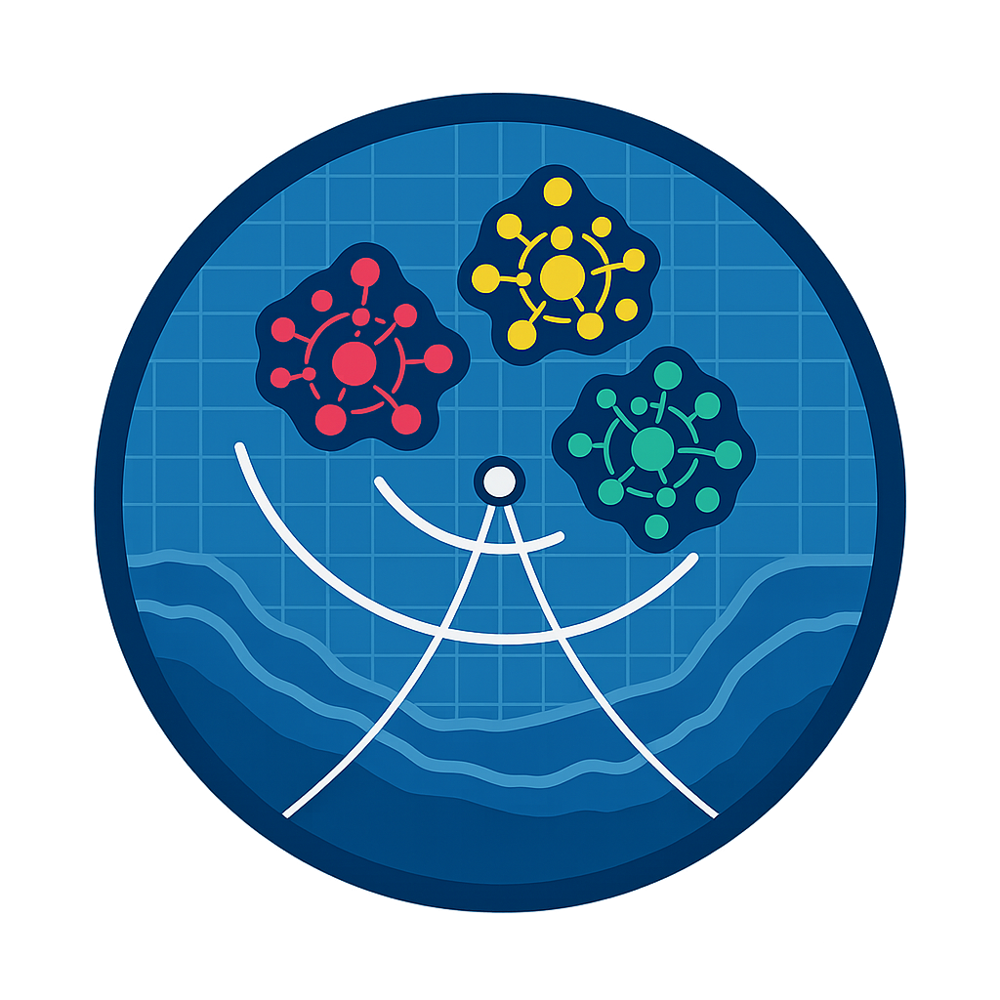
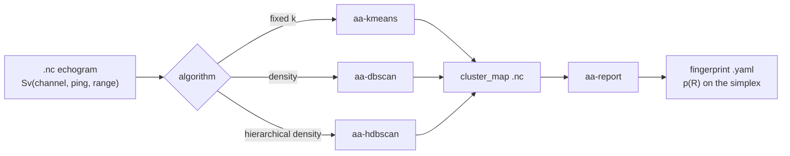

<!--
========================================================================
README.md — AA-SI_KMEANS  (https://github.com/nmfs-ost/AA-SI_KMEANS)
------------------------------------------------------------------------
AI-NOTE (for assistants reading this file in the future):

This library is *not* a generic KMeans wrapper, despite the repo name.
It is a small suite of Unix-style console tools for clustering
multi-frequency echosounder data (acoustic backscatter) using a
unified (alpha, beta) feature construction shared across KMeans,
DBSCAN, and HDBSCAN.  The repo name predates the architecture; do
not assume "KMeans-only" when reading the source.

The single most important thing to internalise before answering
questions about this code is the math in the "Mathematical
Foundation" section below — particularly the (Sv_mean, c) split and
the (alpha, beta) parameterisation.  Every tool here operates in the
same phi-space, and almost every user question maps to "what does
(alpha, beta) do here?".

Source-of-truth for the math: KMeans/kmeans_core.py
  (build_feature_matrix, split_loudness_colour, PRESETS).
DBSCAN/HDBSCAN cores re-import these helpers — do not duplicate.

When the user asks "how do I cluster X", route through:
   raw .nc  ->  aa-{kmeans|dbscan|hdbscan}  ->  cluster_map .nc
                                            ->  aa-report  ->  fingerprint .yaml
========================================================================
-->

<div align="center">



# `aa-kmap` — Acoustic Cluster Maps & Fingerprints

**Unix-style clustering for multi-frequency echosounder data, with a unified $(\alpha, \beta)$ feature space shared across KMeans, DBSCAN, and HDBSCAN.**

[](LICENSE)
[](pyproject.toml)
[](#the-pipeline)
[]()

</div>

---

## Contents

- [What this library does](#what-this-library-does)
- [Install](#install)
- [The pipeline](#the-pipeline)
- [Mathematical foundation](#mathematical-foundation)
  - [The pixel as a multi-frequency vector](#1-the-pixel-as-a-multi-frequency-vector)
  - [The loudness–colour decomposition](#2-the-loudnesscolour-decomposition)
  - [The unified $(\alpha, \beta)$ feature map](#3-the-unified-alpha-beta-feature-map)
  - [Why only $\beta/\alpha$ matters (for KMeans)](#4-why-only-betaalpha-matters-for-kmeans)
  - [Named presets](#5-named-presets)
- [Console tools](#console-tools)
- [Output format & fingerprints](#output-format--fingerprints)
- [Project layout](#project-layout)
- [For developers and AI assistants](#for-developers-and-ai-assistants)
- [Citation / License](#citation--license)

---

## What this library does

Echosounders ping the water column at several frequencies (e.g. 18, 38, 70, 120, 200 kHz) and record the volume backscattering strength $S_v$ at each frequency, in dB. Different scatterers — krill, gas-bladdered fish, mesopelagic mixes, plankton — have different **frequency responses**, and that signature is what acoustic ecologists exploit to tell them apart.

This library takes a `.nc` file containing $S_v(\text{channel}, \text{ping}, \text{range})$ and produces:

1. A **cluster map** — same shape as the echogram, integer labels per pixel — using KMeans, DBSCAN, or HDBSCAN, all in a single shared feature space.
2. A **fingerprint report** — a YAML document containing a probability vector $p(R) = (p_1, \dots, p_k)$ on the simplex (the "cluster ratio" of a region of interest), ready for Hellinger-distance comparison against a codebook of labelled fingerprints.

Every tool is a small, composable program that reads a path from `stdin` or `argv`, does one thing, and writes a path to `stdout`. They chain.

---

## Install

```bash
git clone https://github.com/nmfs-ost/AA-SI_KMEANS.git
cd AA-SI_KMEANS
pip install -e .
```

This installs four console entry points: `aa-kmeans`, `aa-dbscan`, `aa-hdbscan`, `aa-report`.

---

## The pipeline



In the shell that looks like:

```bash
echo data.nc | aa-kmeans --preset contrast -k 4 | aa-report --tag krill > path.txt
```

---

## Mathematical foundation

> The rest of this README assumes you've read this section. It's short.

### 1. The pixel as a multi-frequency vector

For one echogram cell at $(\text{ping}, \text{range})$, stack the $N$ selected channels into a vector:

$$
\mathbf{x} \;=\; (S_{v,1},\; S_{v,2},\; \dots,\; S_{v,N}) \;\in\; \mathbb{R}^N
$$

Each $S_{v,i}$ is in dB. Working in dB matters: the **shape** of $\mathbf{x}$ across frequency carries the biology, and additive dB offsets (calibration drift, range-dependent absorption) corrupt the absolute level but not the shape.

### 2. The loudness–colour decomposition

Decompose $\mathbf{x}$ into a scalar **loudness** and a **colour** vector:

$$
\underbrace{\bar{S}_v \;=\; \frac{1}{N}\sum_{i=1}^{N} S_{v,i}}_{\text{loudness (scalar)}}
\qquad\qquad
\underbrace{c_i \;=\; S_{v,i} - \bar{S}_v}_{\text{colour (vector, } \sum_i c_i = 0\text{)}}
$$

This is just the projection of $\mathbf{x}$ onto two orthogonal subspaces of $\mathbb{R}^N$:

$$
\mathbb{R}^{N} \;=\; \mathrm{span}(\mathbf{1})\;\oplus\;\mathbf{1}^{\perp},
\qquad
\mathbf{x} \;=\; \bar{S}_v\,\mathbf{1} \;+\; \mathbf{c}
$$

with $\mathbf{1} = (1,\dots,1)$. The two pieces have clean physical meanings:

| Component | Lives in | Encodes | Confounded by |
|-----------|----------|---------|---------------|
| $\bar{S}_v$ — loudness | $\mathrm{span}(\mathbf{1})$, 1-D | scatterer **density / intensity** | range, calibration, bulk volume |
| $\mathbf{c}$ — colour | $\mathbf{1}^{\perp}$, $(N{-}1)$-D | **frequency response** (the species signature) | almost nothing additive in dB |

Because the decomposition is orthogonal, you can up-weight one side without disturbing the other. That is the leverage the rest of this library is built on.

### 3. The unified $(\alpha, \beta)$ feature map

Every clusterer in this repo runs on the same feature vector:

$$
\boxed{\;\;\boldsymbol{\varphi}(\mathbf{x}) \;=\; \big(\,\alpha\,c_1,\; \alpha\,c_2,\; \dots,\; \alpha\,c_N,\; \beta\,\bar{S}_v\,\big) \;\in\; \mathbb{R}^{N+1}\;\;}
$$

with $\alpha,\beta \ge 0$ and not both zero. Columns whose weight is exactly zero are dropped before clustering, so:

- $(\alpha>0,\, \beta=0)$ produces an $N$-column matrix (colour only);
- $(\alpha=0,\, \beta>0)$ produces a 1-column matrix (loudness only);
- $(\alpha>0,\, \beta>0)$ produces an $(N{+}1)$-column matrix (both).

### 4. Why only $\beta/\alpha$ matters (for KMeans)

The squared Euclidean distance between two pixels in $\boldsymbol{\varphi}$-space is

$$
\|\boldsymbol{\varphi}(\mathbf{x}) - \boldsymbol{\varphi}(\mathbf{x}')\|^2
\;=\; \alpha^2 \sum_{i=1}^{N}\!\big(c_i - c_i'\big)^2 \;+\; \beta^2 \big(\bar{S}_v - \bar{S}_v'\big)^2.
$$

Rescaling $(\alpha,\beta) \to (\lambda\alpha,\,\lambda\beta)$ for any $\lambda>0$ multiplies **every** pairwise distance by $\lambda^2$. KMeans minimises a sum of squared distances, and that minimisation is invariant under a global rescaling of the metric. Therefore:

> For KMeans, the partition depends only on the ratio $\beta/\alpha$, not on the magnitudes individually.

The recommended workflow is to **fix $\alpha = 1$ and sweep $\beta$**.

> [!IMPORTANT]
> This invariance is **KMeans-specific**. DBSCAN and HDBSCAN both use a hard radius `eps` (or core-distance) measured in $\boldsymbol{\varphi}$-space units. If you change $\alpha$ or $\beta$ for those algorithms, you must rescale `eps` to match — see the docstrings in `dbscan_core.py` and `hdbscan_core.py`.

### 5. Named presets

Three corners of the $(\alpha,\beta)$ space recover classical recipes used in fisheries acoustics:

| Preset | $(\alpha,\beta)$ | Meaning | Equivalent to |
|--------|------------------|---------|---------------|
| **`direct`**   | $(1, 1)$ | Info-equivalent to raw $S_v$ vector | Clustering on raw multifreq dB |
| **`contrast`** | $(1, 0)$ | Colour-only — pure frequency response | "Centered ABD" / spectrum-only |
| **`loudness`** | $(0, 1)$ | Loudness-only — mean dB scalar | Threshold-style density partition |

Aliases `dir`, `abd`, `mean` are kept for backward compatibility with older configs.

> **Why "direct" $=(1,1)$ is information-equivalent to raw $S_v$:** the change of basis $\mathbf{x}\,\mapsto\,(c_1,\dots,c_N,\bar{S}_v)$ is linear and (with the $\sum c_i = 0$ constraint) preserves the same information content as $\mathbf{x}$ itself, up to a constant Jacobian. Setting $\alpha=\beta=1$ keeps that linear map isometric in spirit, so KMeans on `direct` and KMeans on raw $\mathbf{x}$ produce *the same* partitions.

---

## Console tools

All four tools follow the same I/O contract: read a path from `stdin` or `argv`, write a path to `stdout`, log everything else to `stderr`. They chain with pipes.

<details>
<summary><b><code>aa-kmeans</code> — fixed-k partitioning</b></summary>

```bash
aa-kmeans <file.nc> [--preset {direct|contrast|loudness}]
                    [--alpha FLOAT] [--beta FLOAT]
                    [-k INT] [--channels I J K ...]
                    [--n_init INT] [--max_iter INT] [--random_state INT]
                    [-o OUT.nc]
```

- Discovers exactly $k$ clusters; no noise label.
- Output: `cluster_map` only.
- Use when you want a fixed-$k$ basis for codebook construction or when you've already calibrated $k$ from an elbow / silhouette pass.

```bash
# Fix alpha=1, sweep beta
for b in 0 0.25 0.5 1 2 4; do
    aa-kmeans data.nc --alpha 1 --beta $b -k 4 -o "out_b${b}.nc"
done
```
</details>

<details>
<summary><b><code>aa-dbscan</code> — density-based, auto-discovers k</b></summary>

```bash
aa-dbscan <file.nc> [--preset {direct|contrast|loudness}]
                    [--alpha FLOAT] [--beta FLOAT]
                    [--eps FLOAT] [--min_samples INT]
                    [--channels I J K ...] [-o OUT.nc]
```

- Discovers the number of clusters from data density.
- Pixels outside any dense region get label `-1` (noise).
- Output: `cluster_map` only — DBSCAN does not produce per-pixel membership scores or per-cluster persistence.
- $\varepsilon$ lives in $\boldsymbol{\varphi}$-space units. **Rescale it whenever you change $\alpha$ or $\beta$.**
</details>

<details>
<summary><b><code>aa-hdbscan</code> — hierarchical density (recommended for fingerprinting)</b></summary>

```bash
aa-hdbscan <file.nc> [--preset {direct|contrast|loudness}]
                     [--alpha FLOAT] [--beta FLOAT]
                     [--min_cluster_size INT] [--min_samples INT]
                     [--cluster_selection_method {eom|leaf}]
                     [--cluster_selection_epsilon FLOAT]
                     [--channels I J K ...] [-o OUT.nc]
```

- Discovers $k$ automatically *and* exposes three diagnostics that DBSCAN does not:

| Output variable | Meaning | Range |
|---|---|---|
| `cluster_map` | integer labels (`-1` = noise) | $\mathbb{Z}$ |
| `membership_probability` | per-pixel cluster strength | $[0, 1]$ |
| `outlier_score` | per-pixel GLOSH outlier score | $[0, 1]$ |
| `cluster_persistence` | per-cluster stability score | $[0, \infty)$ |

The persistence vector is what `aa-report` uses to build *persistence-weighted* fingerprints.
</details>

<details>
<summary><b><code>aa-report</code> — cluster-ratio fingerprint generator</b></summary>

```bash
aa-report <cluster_map.nc> [--tag NAME]
                           [--roi_ping "T0:T1"] [--roi_range "R0:R1"]
                           [--source_sv data.nc]
                           [-o report.yaml]
```

For a region of interest $R$ and a clustering with $k$ clusters, the **cluster-ratio fingerprint** is

$$
p(R) \;=\; \big(p_1, p_2, \dots, p_k\big), \qquad p_j \;=\; \frac{\#\{(\text{ping},\text{range})\in R : \text{label}=j\}}{\#\{(\text{ping},\text{range})\in R : \text{label}\ne -1\}},
\qquad \sum_j p_j = 1.
$$

So $p(R)$ lives on the standard $(k{-}1)$-simplex $\Delta^{k-1}$. Two fingerprints from the **same clustering run** can be compared via the **Hellinger distance**:

$$
d_H\!\big(p, q\big) \;=\; \frac{1}{\sqrt{2}}\,\Big\lVert\sqrt{p} - \sqrt{q}\,\Big\rVert_2 \;\in\; [0, 1].
$$

The report is a structured YAML containing provenance, $(\alpha,\beta)$ config, $p(R)$, per-cluster centroids in raw-$S_v$ / colour / loudness coordinates, and a user-assignable `--tag`. See [Output format & fingerprints](#output-format--fingerprints).
</details>

---

## Output format & fingerprints

Every cluster-map NetCDF carries the full clustering configuration in its global attributes — `alpha`, `beta`, `beta_over_alpha`, `preset`, `channels_used`, `feature_columns`, and the algorithm-specific hyperparameters. This means a `cluster_map.nc` is **self-describing**: `aa-report` does not need to be told how it was generated.

The fingerprint YAML emitted by `aa-report` looks roughly like:

```yaml
provenance:
  source_tool: aa-hdbscan
  source_file: 2024-08-12_GeorgesBank_hdbscan.nc
  generated_at: 2026-04-30T14:22:11Z
clustering:
  algorithm: HDBSCAN
  alpha: 1.0
  beta: 0.5
  beta_over_alpha: 0.5
  preset: custom
  channels: [0, 1, 2, 3]
echoclassification: krill_swarm
region_of_interest:
  ping_range: [1200, 1850]
  range_sample: [40, 220]
fingerprint:
  simplex_dimension: 6
  p: [0.412, 0.318, 0.115, 0.087, 0.051, 0.017]
  dominant_cluster: 0
comparability:
  metric: hellinger
  rule: "Two fingerprints are directly comparable iff they share alpha, beta, channels, and clustering run."
```

> [!TIP]
> Fingerprints from **different** clustering runs are **not** directly comparable, even if both report $k=6$. To compare across runs you must either re-cluster on a shared codebook or project both onto a reference partition. The `comparability` block in the YAML enforces this discipline.

---

## Project layout

```
AA-SI_KMEANS/
├── KMeans/                       # core package (capital K is historical)
│   ├── kmeans_core.py            # SOURCE OF TRUTH for the (alpha, beta) math
│   ├── dbscan_core.py            # imports build_feature_matrix from kmeans_core
│   ├── hdbscan_core.py           # imports build_feature_matrix from kmeans_core
│   └── console/
│       ├── aa_kmeans.py          # CLI: aa-kmeans
│       ├── aa_dbscan.py          # CLI: aa-dbscan
│       ├── aa_hdbscan.py         # CLI: aa-hdbscan
│       └── aa_report.py          # CLI: aa-report
├── docs/
│   ├── aalibrary_training.md
│   └── prompts/training.md
├── assets/logo.png
├── pyproject.toml
├── setup.py
├── requirements.txt
├── CHANGELOG.md
├── CONTRIBUTING.md
├── LICENSE
└── README.md                     # ← you are here
```

The three `*_core.py` modules deliberately mirror each other's API. The DBSCAN and HDBSCAN cores import `build_feature_matrix`, `split_loudness_colour`, `PRESETS`, and `resolve_preset` from `kmeans_core` so the feature space is **bit-identical** across the three algorithms at a given $(\alpha, \beta)$.

---

## For developers and AI assistants

<!--
========================================================================
AI-NOTE: developer / agent orientation
------------------------------------------------------------------------
If you (an AI assistant) are about to modify code in this repo, read
this section before touching anything.  It encodes load-bearing
invariants that are not obvious from any single file.
========================================================================
-->

A few invariants this codebase relies on. Breaking any of them will silently corrupt the fingerprint comparison story:

1. **The feature space is shared.** All three `*_core.py` modules construct features through `kmeans_core.build_feature_matrix`. Do not reimplement it. If you need a new transformation, add it to `kmeans_core.py` and import it.

2. **The `(\alpha, \beta)` partition invariance is KMeans-only.** DBSCAN's `eps` and HDBSCAN's `cluster_selection_epsilon` live in $\boldsymbol{\varphi}$-space units. Any code path that rescales $\alpha$ or $\beta$ for those algorithms without also rescaling the radius parameter is a bug.

3. **NaN handling is uniform.** A pixel where any selected channel is NaN propagates to NaN in both $\bar{S}_v$ and every $c_i$ (see `split_loudness_colour`). All three clusterers then mask those rows out and assign label `-1`. Do not change this — `aa-report` distinguishes "noise from the algorithm" and "input was missing" using exactly this convention plus the `outlier_score`/`membership_probability` channels.

4. **Cluster maps are self-describing.** Every output NetCDF embeds:
   - the full clustering config (algorithm, $\alpha$, $\beta$, hyperparameters, channels used, feature column names),
   - the `AcousticVariable` descriptor (`acoustic_variable_*` attrs).

   `aa-report` reads these back. If you write a new clusterer, mirror this attribute schema.

5. **Adding a new acoustic variable** (e.g. NASC, $s_A$): append an entry to `ACOUSTIC_VARIABLES` in `kmeans_core.py`. Do **not** hardcode `"Sv"` strings anywhere else — every variable-aware code path resolves through `get_variable_descriptor`.

6. **The Unix-pipeline contract.** Each console tool reads a path from `stdin` *or* `argv`, performs one operation, and writes a path to `stdout`. Logging goes to `stderr` via `loguru`. If you add a new tool, do not break this — it is what makes the `echo X | aa-foo | aa-bar` chain work.

<!--
AI-NOTE: when answering user questions, prefer pointing at the math
in section 3 over describing the algorithms.  Users almost always
want to know "what does (alpha, beta) do?", not "what is HDBSCAN?".
-->

---

## Citation / License

If you use this software in published work, please cite the NMFS Office of Science and Technology Active Acoustics group and link to this repository.

Released under the terms in [`LICENSE`](LICENSE). Contributions are welcome — see [`CONTRIBUTING.md`](CONTRIBUTING.md).

<div align="center">

— maintained by NOAA Fisheries / NMFS-OST —

</div>