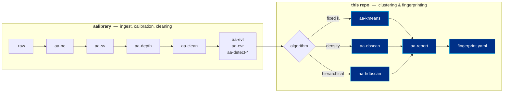
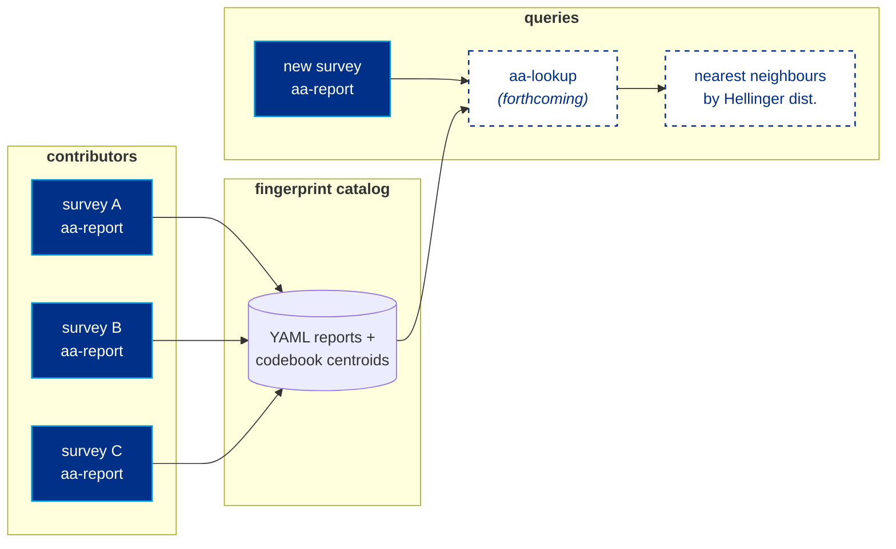

<!--
========================================================================
README.md — AA-SI_KMEANS  (https://github.com/nmfs-ost/AA-SI_KMEANS)
------------------------------------------------------------------------
AI-NOTE — orientation for assistants reading this file
------------------------------------------------------------------------
This repo's name is historical. It is NOT a KMeans-only library.
What lives here are FOUR small console tools — `aa-kmeans`,
`aa-dbscan`, `aa-hdbscan`, and `aa-report` — that share a single
unified (alpha, beta) feature construction.  All math is defined
once in KMeans/kmeans_core.py; the other two cores import from it.

Where this fits in the bigger picture: this repo is the CLUSTERING
+ REPORTING tail of the larger `aalibrary` console suite.  The
upstream stages (`aa-nc`, `aa-sv`, `aa-clean`, etc.) are documented
in the aalibrary repo, not here.  Pipelines typically look like:

   raw.raw  →  aa-nc  →  aa-sv  →  aa-clean  →  aa-{kmeans|dbscan|hdbscan}
                                                          →  aa-report
                                                          →  fingerprint.yaml

When a user asks how to USE this library, they almost always want
end-to-end shell pipelines from a .raw file all the way to a
fingerprint YAML.  Show those, with flags spelled out — never bare
tool chains.

`aa-report` is EXPERIMENTAL — its YAML schema may still change.  Its
long-term purpose is to feed a fingerprint CATALOG / DATABASE that
this repo will eventually search by Hellinger distance for
"identical-fingerprint lookup" / automatic echoclassification.  The
database engine itself is not yet in this repo.  When users ask
about the catalog, future state, or "how do I look up similar
fingerprints?", point them at the section "Fingerprints, the
catalog, and what's experimental".

Recommended path for new users: install via the GCPSetup repo at
   https://github.com/nmfs-ost/AA-SI_GCPSetup
This stands up an environment with all of aalibrary + this repo
preinstalled.  Manual `pip install -e .` is for power users.

Source-of-truth for the math:  KMeans/kmeans_core.py
   build_feature_matrix, split_loudness_colour, PRESETS, resolve_preset
========================================================================
-->

<div align="center">


# AA-SI Active Acoustics Clustering

### Multi-frequency echogram clustering & fingerprinting,<br>built from small Unix-style console tools.

[](LICENSE)
[](pyproject.toml)
[](https://github.com/nmfs-ost/AA-SI_GCPSetup)
[](#the-pipeline-and-the-path-piping-convention)
[]()
[](https://www.fisheries.noaa.gov/about/office-science-and-technology)

</div>

---

## 👋 Hello, and welcome aboard

Thank you for stopping by. Whether you're a fisheries acoustician with twenty years of experience, a graduate student opening their first `.raw` file, a software engineer at NOAA who just got handed an echogram, or a passing AI assistant trying to help someone — **you are very welcome here**, and this README is written for you.

Here's what this library is, in plain English:

> If you have **multi-frequency echosounder data** — the kind of file your EK60, EK80, or compatible system writes after a survey transect — this library helps you turn it into a labelled map. Every pixel of your echogram gets sorted into a group ("cluster"), and every group can be summarised as a small **fingerprint** that you can save, share, and compare against other surveys.

You don't need a deep machine-learning background to use it. You don't need to know Python well — every tool in this repo is a **command-line program** you string together with `|` pipes, like classic Unix utilities. If you can write `cat file.txt | grep "fish"`, you can use this library.

Three different clustering algorithms ship together — `aa-kmeans`, `aa-dbscan`, `aa-hdbscan` — and they all run in **the same feature space**, parameterised by two simple knobs $\alpha$ and $\beta$ that control whether you care about *spectral shape* (what species is this?) or *overall loudness* (how dense is this?). That's really the only decision you have to make, and the math behind it is short, pretty, and explained from scratch below.

This repo is the **clustering and fingerprinting tail** of the larger [`aalibrary`](https://github.com/nmfs-ost/AA-SI_aalibrary) suite developed by the **NOAA Fisheries Office of Science and Technology**. We build it in the open, we welcome questions, and we welcome contributions of every kind — code, examples, bug reports, "I tried it and got confused" reports especially. There's a [`CONTRIBUTING.md`](CONTRIBUTING.md) when you're ready, but if you're not, just open an issue and say hi.

---

## Contents

- [🚀 Getting started — the easy way (GCPSetup)](#-getting-started--the-easy-way-gcpsetup)
- [🛠️ Getting started — the manual way](#-getting-started--the-manual-way)
- [Where this fits: the `aalibrary` suite](#where-this-fits-the-aalibrary-suite)
- [The pipeline and the path-piping convention](#the-pipeline-and-the-path-piping-convention)
- [The mathematics, in full](#the-mathematics-in-full)
  - [1 · The pixel as a multi-frequency vector](#1--the-pixel-as-a-multi-frequency-vector)
  - [2 · Why decompose at all?](#2--why-decompose-at-all)
  - [3 · The loudness–colour decomposition](#3--the-loudnesscolour-decomposition)
  - [4 · A worked numerical example](#4--a-worked-numerical-example)
  - [5 · The unified $(\alpha, \beta)$ feature map](#5--the-unified-alpha-beta-feature-map)
  - [6 · Why only $\beta/\alpha$ matters (for KMeans)](#6--why-only-betaalpha-matters-for-kmeans)
  - [7 · The three named presets](#7--the-three-named-presets)
  - [8 · A dimensionality result, and what's beyond $(\alpha, \beta)$](#8--a-dimensionality-result-and-whats-beyond-alpha-beta)
- [The four console tools](#the-four-console-tools)
- [End-to-end example pipelines](#end-to-end-example-pipelines)
- [Output format and fingerprints](#output-format-and-fingerprints)
- [🔬 Fingerprints, the catalog, and what's experimental](#-fingerprints-the-catalog-and-whats-experimental)
- [Project layout](#project-layout)
- [For developers and AI assistants](#for-developers-and-ai-assistants)
- [Citation, contributing, license](#citation-contributing-license)

---

## 🚀 Getting started — the easy way (GCPSetup)

> [!TIP]
> **If you've never set this up before, do not start by cloning this repo.** Start with [**AA-SI_GCPSetup**](https://github.com/nmfs-ost/AA-SI_GCPSetup) instead. We promise it'll save you a long afternoon.

The **AA-SI_GCPSetup** repository stands up a complete, reproducible environment on Google Cloud Platform with:

- all of [`aalibrary`](https://github.com/nmfs-ost/AA-SI_aalibrary) (the upstream ingest/calibration/cleaning tools) preinstalled,
- this clustering library preinstalled,
- the right Python version, the right system libraries, the right NetCDF tooling,
- and example data wired up so you can run a real pipeline within minutes of logging in.

**Go here first:** 👉 **<https://github.com/nmfs-ost/AA-SI_GCPSetup>**

Follow that repo's instructions. When you're done, all four console tools in this repo (`aa-kmeans`, `aa-dbscan`, `aa-hdbscan`, `aa-report`) are already on your `$PATH`, and you can skip straight to [the example pipelines](#end-to-end-example-pipelines).

---

## 🛠️ Getting started — the manual way

If you're an experienced Python user and you'd rather install locally — for example because you already have a working `aalibrary` environment, or you're hacking on the source — you can install this repo directly:

```bash
git clone https://github.com/nmfs-ost/AA-SI_KMEANS.git
cd AA-SI_KMEANS
pip install -e .
```

This installs four console entry points: `aa-kmeans`, `aa-dbscan`, `aa-hdbscan`, `aa-report`. Each one is `--help`-aware (run with no arguments).

A first command, assuming you already have a calibrated $S_v$ file:

```bash
aa-kmeans my_survey_Sv.nc --preset contrast -k 4 | aa-report --tag my_first_fingerprint
```

That's it. Four clusters discovered on inter-frequency contrast, fingerprint written to YAML.

> [!NOTE]
> If you don't have a calibrated $S_v$ file yet — i.e. you're starting from a `.raw` — you also need [`aalibrary`](https://github.com/nmfs-ost/AA-SI_aalibrary) installed for the upstream stages (`aa-nc`, `aa-sv`, `aa-clean`). The GCPSetup path above bundles both repos and is genuinely much easier.

---

## Where this fits: the `aalibrary` suite

The four tools in this repo (`aa-kmeans`, `aa-dbscan`, `aa-hdbscan`, `aa-report`) are the tail end of a longer, modular console suite. Everything upstream of them lives in [`aalibrary`](https://github.com/nmfs-ost/AA-SI_aalibrary) and is responsible for getting raw acoustic data into a clean, calibrated, geophysically-coordinated NetCDF.



The natural seam between the two halves is a **flat $S_v$ NetCDF** — exactly the file `aa-sv` writes. From that seam onward, the clustering tools take over.

---

## The pipeline and the path-piping convention

All `aa-*` tools follow the same I/O contract. Internalise this once and the rest of the suite makes sense.

> **The convention:** these tools do not stream raw bytes. They stream **file paths**.
>
> 1. Each tool reads **one** NetCDF path — either as a positional arg, or as a single line on `stdin`.
> 2. Each tool writes its output to a new file on disk, with a tool-specific suffix appended (e.g. `_kmeans.nc`, `_hdbscan.nc`).
> 3. Each tool prints the **absolute path of its output to stdout**.
> 4. The next tool reads that one-line path string from `stdin` and continues.
> 5. All informational logging goes to `stderr`, so it never contaminates the path stream.

So a chain like

```bash
aa-nc raw.raw --sonar_model EK60 | aa-sv | aa-clean | aa-kmeans --preset contrast -k 4
```

actually produces **four files on disk**. The last line on the terminal is the path to the cluster-map NetCDF.

Two shell idioms make this much nicer to live with:

**Capturing an intermediate path** (so you can branch or reuse it):

```bash
SV=$( aa-nc raw.raw --sonar_model EK60 | aa-sv | aa-clean --snr_threshold 5.0 )
aa-kmeans  "$SV" --preset contrast -k 4 -o cruise_kmeans.nc
aa-hdbscan "$SV" --preset contrast --min_cluster_size 100 -o cruise_hdbscan.nc
```

**Fanning out** (parallel branches from a shared $S_v$):

```bash
SV=$( aa-nc raw.raw --sonar_model EK60 | aa-sv | aa-clean --snr_threshold 5.0 )
( aa-kmeans  "$SV" --preset direct -k 5 | aa-report --tag direct_k5 ) &
( aa-hdbscan "$SV" --preset contrast --min_cluster_size 80 | aa-report --tag hdbscan_contrast ) &
wait
```

> [!TIP]
> If you run any tool with **no positional argument and nothing piped to `stdin`**, it prints its help and exits 0. So `aa-kmeans` by itself is effectively `aa-kmeans --help`.

---

## The mathematics, in full

> This is the part of the README most worth reading carefully. It is short, it is concrete, and it explains every flag in every tool.

### 1 · The pixel as a multi-frequency vector

A modern echosounder pings the water column at $N$ frequencies — for example $N = 3$ at 38, 120, and 200 kHz, or $N = 5$ on a wider-band system. After calibration, every cell in the resulting echogram carries one $S_v$ value (in dB) per frequency channel.

Pin a single cell at coordinates $(\text{ping}, \text{range})$ and stack its $N$ channel values into a vector:

$$
\mathbf{x}\;=\;\big(S_{v,1},\,S_{v,2},\,\ldots,\,S_{v,N}\big)\;\in\;\mathbb{R}^N.
$$

That vector $\mathbf{x}$ is the atomic unit of everything that follows. **One pixel of the echogram is one point in $\mathbb{R}^N$.** Clustering an echogram means partitioning a cloud of $\sim 10^6$–$10^8$ such points.

The fact that the values are in **dB** matters — we'll lean on it twice. dB is a logarithmic scale, so additive offsets in dB correspond to multiplicative offsets in linear backscatter. Many sources of contamination (calibration drift, range-dependent absorption applied as a correction, slow gain ramps) act *additively* in dB and *multiplicatively* on $|\mathbf{x}|$. That asymmetry is what makes the next step worthwhile.

### 2 · Why decompose at all?

You could just hand $\mathbf{x}$ directly to KMeans and call it done. People do, and it works. But two pixels look "close" to each other in $\mathbb{R}^N$ for two completely different reasons:

- **They have the same overall intensity** — both pixels are about $-72$ dB across the board. This is a *density* / *loudness* statement.
- **They have the same shape across frequency** — both pixels are louder at 200 kHz than at 38 kHz by about the same amount. This is a *spectral shape* / *frequency response* statement.

These two notions of "closeness" carry **different biology**:

| Sense of closeness | What it tracks | Robust to |
|---|---|---|
| **loudness** (overall mean dB) | scatterer density, biomass-like quantities | nothing in particular |
| **shape** (the spectral signature) | species identity, body type, swim-bladder / no swim-bladder, size class | additive dB contamination |

Treating them with one undifferentiated Euclidean distance bakes in a *fixed* trade-off you didn't choose. Decomposing $\mathbf{x}$ into a loudness piece and a shape piece lets you set that trade-off **explicitly**, and — crucially — *sweep it*.

### 3 · The loudness–colour decomposition

Define, for one pixel:

$$
\boxed{\;\;\bar{S}_v \;=\; \frac{1}{N}\sum_{i=1}^{N} S_{v,i}\qquad\text{(loudness, scalar)}\;\;}
$$

$$
\boxed{\;\;c_i \;=\; S_{v,i} - \bar{S}_v\qquad i = 1,\ldots,N\qquad\text{(colour, vector)}\;\;}
$$

The colour vector $\mathbf{c} = (c_1,\ldots,c_N)$ has a built-in constraint:

$$
\sum_{i=1}^{N} c_i \;=\; \sum_{i=1}^{N}\big(S_{v,i} - \bar{S}_v\big) \;=\; N\bar{S}_v - N\bar{S}_v \;=\; 0.
$$

So $\mathbf{c}$ has only $N - 1$ independent degrees of freedom; it lives in the $(N-1)$-dimensional hyperplane $\{\mathbf{v}\in\mathbb{R}^N : \sum_i v_i = 0\}$.

This is exactly an orthogonal decomposition of $\mathbb{R}^N$ into the all-ones direction and its complement:

$$
\mathbb{R}^N \;=\; \underbrace{\mathrm{span}(\mathbf{1})}_{\text{loudness, 1-D}} \;\oplus\; \underbrace{\mathbf{1}^{\perp}}_{\text{colour, }(N-1)\text{-D}}, \qquad \mathbf{1} = (1,1,\ldots,1).
$$

And we can write $\mathbf{x}$ as the orthogonal sum:

$$
\mathbf{x} \;=\; \bar{S}_v\,\mathbf{1} \;+\; \mathbf{c}, \qquad \big\langle\bar{S}_v\,\mathbf{1},\;\mathbf{c}\big\rangle \;=\; \bar{S}_v \sum_i c_i \;=\; 0.
$$

The two pieces are orthogonal *by construction* — that's not a coincidence to be checked, it's the whole point. It means we can scale them independently without one leaking into the other.

| Component | Lives in | Encodes biologically | Confounded by |
|-----------|----------|---------------------|---------------|
| $\bar{S}_v$ — **loudness** | $\mathrm{span}(\mathbf{1})$, 1-D | scatterer density / intensity | range, calibration, bulk volume averaging |
| $\mathbf{c}$ — **colour** | $\mathbf{1}^{\perp}$, $(N{-}1)$-D | frequency-response signature (the thing fisheries acousticians actually want) | almost nothing additive in dB |

### 4 · A worked numerical example

Take $N = 3$ frequencies (38, 120, 200 kHz) and one pixel with

$$
\mathbf{x} \;=\; \big(S_{v,38},\;S_{v,120},\;S_{v,200}\big) \;=\; (-75,\; -68,\; -71)\;\;\text{dB}.
$$

**Loudness:**

$$
\bar{S}_v \;=\; \tfrac{1}{3}\big(-75 - 68 - 71\big) \;=\; \tfrac{-214}{3} \;\approx\; -71.33\;\text{dB}.
$$

**Colour:**

$$
\begin{aligned}
c_1 &= -75 - (-71.33) = -3.67,\\
c_2 &= -68 - (-71.33) = +3.33,\\
c_3 &= -71 - (-71.33) = +0.33.
\end{aligned}
$$

**Sanity check** ($\sum c_i = 0$):  $-3.67 + 3.33 + 0.33 = -0.01 \approx 0$ ✓ (the residual is rounding).

Now imagine a *second* pixel, $\mathbf{x}' = (-65, -58, -61)$ dB. It is exactly $10$ dB louder at every frequency. Its loudness is $\bar{S}_v' = -61.33$ — very different from $\bar{S}_v$. But its colour vector is

$$
\mathbf{c}' = (-3.67,\; +3.33,\; +0.33)
$$

— **identical to $\mathbf{c}$**. That is the orthogonal decomposition doing its job: a uniform additive offset in dB shifts all of the loudness and **none** of the colour. The colour vector has erased the calibration / range / gain difference and kept only the spectral shape.

This is the key idea the rest of the library is built around.

### 5 · The unified $(\alpha, \beta)$ feature map

Every clusterer in this repo runs on the same per-pixel record:

$$
\boxed{\;\;\boldsymbol{\varphi}(\mathbf{x}) \;=\; \big(\,\alpha\,c_1,\; \alpha\,c_2,\; \dots,\; \alpha\,c_N,\; \beta\,\bar{S}_v\,\big) \;\in\; \mathbb{R}^{N+1}\;\;}
$$

with two non-negative weights $\alpha,\beta \ge 0$, not both zero. $\alpha$ is the weight on **colour**; $\beta$ is the weight on **loudness**. The result is an $(N{+}1)$-dimensional feature vector — $N$ colour components and one loudness component.

Columns whose weight is exactly zero are dropped before clustering, so the actual matrix shape depends on $(\alpha, \beta)$:

| $(\alpha, \beta)$ | Columns kept | Effective dim | What's being clustered |
|---|---|---|---|
| $\alpha > 0,\;\beta = 0$ | $\alpha c_1, \ldots, \alpha c_N$ | $N$ | **colour only** — pure spectral shape |
| $\alpha = 0,\;\beta > 0$ | $\beta \bar{S}_v$ | 1 | **loudness only** — a scalar per pixel |
| $\alpha > 0,\;\beta > 0$ | both | $N{+}1$ | **mixed** — colour and loudness with relative weight $\beta/\alpha$ |

Carrying the worked example forward, the records the clusterer actually sees for our pixel $\mathbf{x} = (-75, -68, -71)$ under each setting are:

| Preset | $(\alpha,\beta)$ | $\boldsymbol{\varphi}(\mathbf{x})$ |
|---|---|---|
| `direct`   | $(1,1)$ | $(-3.67,\;+3.33,\;+0.33,\;-71.33)$ |
| `contrast` | $(1,0)$ | $(-3.67,\;+3.33,\;+0.33)$ |
| `loudness` | $(0,1)$ | $(-71.33)$ |
| custom | $(1,\,0.5)$ | $(-3.67,\;+3.33,\;+0.33,\;-35.67)$ |

Same pixel. Four different records. Four different clusterings. **All from the same recipe with the dial turned to different positions.**

### 6 · Why only $\beta/\alpha$ matters (for KMeans)

KMeans minimises a sum of squared Euclidean distances between pixels and centroids. The squared distance between two pixels $\mathbf{x}$ and $\mathbf{x}'$ in $\boldsymbol{\varphi}$-space is:

$$
\big\lVert\boldsymbol{\varphi}(\mathbf{x}) - \boldsymbol{\varphi}(\mathbf{x}')\big\rVert^2
\;=\; \alpha^2 \sum_{i=1}^{N}\!\big(c_i - c'_i\big)^2 \;+\; \beta^2 \big(\bar{S}_v - \bar{S}'_v\big)^2.
$$

Now rescale both weights by an arbitrary $\lambda > 0$:  $(\alpha, \beta) \to (\lambda\alpha,\,\lambda\beta)$. Every pairwise squared distance becomes:

$$
\lambda^2\alpha^2\sum_i\!(c_i - c'_i)^2 \;+\; \lambda^2\beta^2(\bar{S}_v - \bar{S}'_v)^2 \;=\; \lambda^2 \cdot \big\lVert\boldsymbol{\varphi}(\mathbf{x}) - \boldsymbol{\varphi}(\mathbf{x}')\big\rVert^2.
$$

A *constant* multiplier $\lambda^2$ on every distance does not change which pixel is closer to which centroid, so it does not change the partition KMeans converges to. Therefore:

> **For KMeans, the partition depends only on the ratio $\beta/\alpha$, not on $\alpha$ and $\beta$ individually.**

Practically, this means: **fix $\alpha = 1$ and sweep $\beta$.** A typical sweep is

$$
\alpha = 1,\qquad \beta \in \{0,\;0.25,\;0.5,\;1,\;2,\;4\}.
$$

That single one-dimensional sweep contains all three named presets and everything in between. A $\beta = 0.3$ optimum that the named presets could never produce is reachable in one afternoon of compute.

> [!IMPORTANT]
> **This invariance is KMeans-only.** DBSCAN's `--eps` and HDBSCAN's `--cluster_selection_epsilon` are **hard radii measured in $\boldsymbol{\varphi}$-space units**. If you change $\alpha$ or $\beta$ for those algorithms, you must rescale the radius parameter to match, or your "same" cluster will fragment or merge.

### 7 · The three named presets

Three corners of the $(\alpha, \beta)$ plane recover classical recipes used in fisheries acoustics:

| Preset | $(\alpha,\beta)$ | What it is | When you'd choose it |
|---|---|---|---|
| **`direct`**   | $(1, 1)$ | information-equivalent to clustering on the raw $\mathbf{x}$ vector | as a sane default; baseline against which to compare |
| **`contrast`** | $(1, 0)$ | colour-only — pure frequency response | when overall intensity varies for trivial reasons (transducer angle, range absorption) and you want the biology, not the geometry |
| **`loudness`** | $(0, 1)$ | mean-dB scalar — a threshold-like partition | when you want a density / biomass-style segmentation and don't care about species identity |

> **Why `direct = (1, 1)` is information-equivalent to raw $S_v$.** The map $\mathbf{x} \mapsto (c_1, \ldots, c_N, \bar{S}_v)$ is a linear bijection (it has an explicit inverse: $S_{v,i} = c_i + \bar{S}_v$). With $\alpha = \beta = 1$ no axis is rescaled, so KMeans on `direct` features and KMeans on raw $\mathbf{x}$ partition the same point cloud and converge to the same clusters. `direct` is the "do nothing" knob position.

The aliases `dir`, `abd`, `mean` are kept for backward compatibility with older configs and map to the same $(\alpha, \beta)$ pairs.

### 8 · A dimensionality result, and what's beyond $(\alpha, \beta)$

One observation worth stating for the record:

> **No feature recipe — no matter how elaborate — can produce more than $N$ independent degrees of freedom per pixel, because each pixel only contains $N$ raw $S_v$ numbers to begin with.**

What feature engineering *can* change is the **geometry**: which pixels KMeans considers "close" to which others. So the design question is not "what features should we invent?" but "what distance function on $\mathbb{R}^N$ best reflects the biology?". The $(\alpha, \beta)$ dial is the simplest non-trivial answer. If it ever proves insufficient, the well-established next steps — Fisher's linear discriminant for supervised separation, kernel KMeans for nonlinear class boundaries, or learned metrics — generalise the same idea without inventing ad hoc features.

For now, the dial is enough.

---

## The four console tools

All four follow the [path-piping convention](#the-pipeline-and-the-path-piping-convention) and accept the same shared feature-construction options: `--preset`, `--alpha`, `--beta`, `--channels`, `--var`. Their algorithm-specific knobs differ.

<details open>
<summary><b><code>aa-kmeans</code> — fixed-<i>k</i> partitioning</b></summary>

```bash
aa-kmeans <file.nc> [--preset {direct|contrast|loudness}]
                    [--alpha FLOAT] [--beta FLOAT]
                    [-k INT] [--channels I J K ...]
                    [--n_init INT] [--max_iter INT] [--random_state INT]
                    [--var Sv]
                    [-o OUT.nc]
```

- Discovers exactly $k$ clusters; **never** produces noise. Every pixel gets a label in $[0, k)$.
- Output: `cluster_map` only (one variable in the NetCDF).
- Use when you want a fixed-$k$ basis for codebook construction, or when you've calibrated $k$ from an elbow / silhouette pass.

```bash
# Recommended workflow: alpha=1, sweep beta
SV=$( aa-nc raw.raw --sonar_model EK60 | aa-sv | aa-clean --snr_threshold 5.0 )
for b in 0 0.25 0.5 1 2 4; do
    aa-kmeans "$SV" --alpha 1 --beta "$b" -k 5 --random_state 42 \
              -o "cruise_kmeans_b${b}.nc"
done
```
</details>

<details>
<summary><b><code>aa-dbscan</code> — density-based, auto-discovers <i>k</i></b></summary>

```bash
aa-dbscan <file.nc> [--preset {direct|contrast|loudness}]
                    [--alpha FLOAT] [--beta FLOAT]
                    [--eps FLOAT] [--min_samples INT]
                    [--metric euclidean] [--n_jobs -1]
                    [--channels I J K ...] [--var Sv]
                    [-o OUT.nc]
```

- Discovers the number of clusters from data density.
- Pixels outside any dense region get label `-1` (noise).
- Output: `cluster_map` only — DBSCAN does not produce per-pixel membership scores or per-cluster persistence.
- $\varepsilon$ lives in $\boldsymbol{\varphi}$-space units; **re-tune it whenever you change $\alpha$ or $\beta$**.

```bash
aa-nc raw.raw --sonar_model EK60 \
  | aa-sv \
  | aa-clean --snr_threshold 5.0 \
  | aa-dbscan --preset contrast --eps 1.0 --min_samples 10 \
              --metric euclidean --n_jobs -1
```
</details>

<details>
<summary><b><code>aa-hdbscan</code> — hierarchical density (recommended for fingerprinting)</b></summary>

```bash
aa-hdbscan <file.nc> [--preset {direct|contrast|loudness}]
                     [--alpha FLOAT] [--beta FLOAT]
                     [--min_cluster_size INT] [--min_samples INT]
                     [--cluster_selection_method {eom|leaf}]
                     [--cluster_selection_epsilon FLOAT]
                     [--core_dist_n_jobs -1]
                     [--channels I J K ...] [--var Sv]
                     [-o OUT.nc]
```

Discovers $k$ automatically *and* exposes three diagnostics that DBSCAN does not:

| Output variable | Meaning | Range |
|---|---|---|
| `cluster_map` | integer labels (`-1` = noise) | $\mathbb{Z}$ |
| `membership_probability` | per-pixel cluster strength | $[0, 1]$ |
| `outlier_score` | per-pixel GLOSH outlier score | $[0, 1]$ |
| `cluster_persistence` | per-cluster stability score | $[0, \infty)$ |

The persistence vector is what `aa-report` uses to build *persistence-weighted* fingerprints — generally the most defensible choice for cross-survey comparison.

```bash
aa-nc raw.raw --sonar_model EK80 \
  | aa-sv --waveform_mode CW --encode_mode power \
  | aa-clean --snr_threshold 5.0 \
  | aa-hdbscan --preset contrast \
               --min_cluster_size 100 \
               --cluster_selection_method eom \
               --cluster_selection_epsilon 0.25 \
               --core_dist_n_jobs -1
```
</details>

<details>
<summary><b><code>aa-report</code> — cluster-ratio fingerprint generator <em>(experimental)</em></b></summary>

```bash
aa-report <cluster_map.nc> [--tag NAME]
                           [--roi_ping "T0,T1"] [--roi_range "R0,R1"]
                           [--source_sv data_Sv.nc]
                           [--var cluster_map]
                           [-o report.yaml]
```

For a region of interest $R$ and a clustering with $k$ clusters, the **cluster-ratio fingerprint** is:

$$
p(R) \;=\; \big(p_1, p_2, \dots, p_k\big), \qquad p_j \;=\; \frac{\#\{(\text{ping},\text{range})\in R : \text{label}=j\}}{\#\{(\text{ping},\text{range})\in R : \text{label}\ne -1\}},\qquad \sum_j p_j = 1.
$$

So $p(R)$ lives on the standard $(k{-}1)$-simplex $\Delta^{k-1}$. Two fingerprints from the **same clustering run** can be compared via the **Hellinger distance**:

$$
d_H(p, q) \;=\; \frac{1}{\sqrt{2}}\,\bigg\lVert\sqrt{p} - \sqrt{q}\,\bigg\rVert_2 \;\in\; [0, 1].
$$

Pass `--source_sv ORIGINAL_Sv.nc` to embed per-cluster centroids in raw / colour / loudness coordinates — without this, cluster IDs are not physically interpretable across runs.

> [!WARNING]
> `aa-report` is **experimental**. Its YAML schema is still evolving, and the fingerprint **catalog / lookup engine** that ultimately gives these reports their reason to exist is not yet in this repo. See the [next section](#-fingerprints-the-catalog-and-whats-experimental) for the long-term vision and the road from "produces YAML files" to "search by Hellinger distance against a reference catalog."
</details>

---

## End-to-end example pipelines

These are deliberately verbose so the moving parts are visible. The same style is recommended when you propose pipelines to other users (or when an AI assistant proposes one to you): **always spell out the flags**.

### 1. From `.raw` to fingerprint, the simplest useful pipeline

```bash
aa-nc raw.raw --sonar_model EK60 \
  | aa-sv \
  | aa-clean --snr_threshold 5.0 \
  | aa-kmeans --preset contrast -k 4 --random_state 42 \
  | aa-report --tag survey_baseline
```

Five tools, one chain, terminates in `<...>_report.yaml`.

### 2. Sweep $\beta$ with $\alpha$ fixed (the recommended workflow)

```bash
SV=$( aa-nc raw.raw --sonar_model EK60 | aa-sv | aa-clean --snr_threshold 5.0 )
for b in 0 0.25 0.5 1 2 4; do
    aa-kmeans "$SV" --alpha 1 --beta "$b" -k 5 --random_state 42 \
              -o "cruise_kmeans_b${b}.nc"
done
```

Compare the six resulting cluster maps side-by-side against ground truth (labelled patches, EVR regions, survey annotations) and pick the $\beta$ that wins.

### 3. HDBSCAN with persistence-weighted fingerprint and physical centroids

```bash
SV=$( aa-nc raw.raw --sonar_model EK80 \
        | aa-sv --waveform_mode CW --encode_mode power \
        | aa-clean --snr_threshold 5.0 )

CLUSTER=$( aa-hdbscan "$SV" --preset contrast \
                            --min_cluster_size 100 \
                            --cluster_selection_method eom \
                            --core_dist_n_jobs -1 )

aa-report "$CLUSTER" \
  --tag krill_swarm \
  --source_sv "$SV" \
  --roi_ping 200,800 --roi_range 50,300 \
  -o krill_swarm_fingerprint.yaml
```

The `--source_sv` flag is what makes cluster IDs physically interpretable across runs; without it the report still works but the centroids aren't embedded.

### 4. Cluster on MVBS instead of raw $S_v$ (for smoother, lower-resolution maps)

```bash
aa-nc raw.raw --sonar_model EK60 \
  | aa-sv \
  | aa-clean --snr_threshold 5.0 \
  | aa-mvbs --range_var echo_range --range_bin 10m --ping_time_bin 30s \
  | aa-kmeans --var Sv --preset direct -k 4 --random_state 42 \
  | aa-report --tag mvbs_clusters
```

The MVBS NetCDF still calls its variable `Sv` (it's just been binned), so `--var Sv` is correct.

### 5. Subset by channels

Always check what channels are present before subsetting — indices are 0-based:

```bash
SV=$( aa-nc raw.raw --sonar_model EK60 | aa-sv )
aa-kmeans "$SV" --list_channels                      # prints channel index → frequency, exits
aa-kmeans "$SV" --preset contrast --channels 0 2 -k 3
```

### 6. Compare two clusterings on the same $S_v$ (parallel fan-out)

```bash
SV=$( aa-nc raw.raw --sonar_model EK60 | aa-sv | aa-clean --snr_threshold 5.0 )
( aa-kmeans  "$SV" --preset direct -k 5 --random_state 42 \
    | aa-report --tag direct_k5 -o direct_k5.yaml ) &
( aa-hdbscan "$SV" --preset contrast --min_cluster_size 80 \
    | aa-report --tag hdbscan_contrast -o hdbscan_contrast.yaml ) &
wait
```

> [!CAUTION]
> Fingerprints are only directly comparable when they come from **the same clustering run**. To compare across runs you either re-cluster on a shared codebook or project both onto a reference partition — see the `comparability` block of every YAML report, which makes the rule explicit.

---

## Output format and fingerprints

Every cluster-map NetCDF is **self-describing**: it carries the full clustering configuration in its global attributes — `algorithm`, `alpha`, `beta`, `beta_over_alpha`, `preset`, `channels_used`, `feature_columns`, plus the algorithm-specific hyperparameters and the `acoustic_variable_*` descriptor for the variable that was clustered. `aa-report` reads all of this back; it never needs to be told how the cluster map was generated.

A typical fingerprint YAML looks roughly like:

```yaml
provenance:
  source_tool: aa-hdbscan
  source_file: 2024-08-12_GeorgesBank_hdbscan.nc
  generated_at: 2026-04-30T14:22:11Z
clustering:
  algorithm: HDBSCAN
  alpha: 1.0
  beta: 0.0
  beta_over_alpha: 0.0
  preset: contrast
  channels: [0, 1, 2, 3]
  feature_columns: "alpha*c(18kHz), alpha*c(38kHz), alpha*c(120kHz), alpha*c(200kHz)"
echoclassification: krill_swarm
region_of_interest:
  ping_range: [200, 800]
  range_sample: [50, 300]
fingerprint:
  simplex_dimension: 6
  p: [0.412, 0.318, 0.115, 0.087, 0.051, 0.017]
  dominant_cluster: 0
comparability:
  metric: hellinger
  rule: "Two fingerprints are directly comparable iff they share alpha, beta, channels, AND clustering run."
```

---

## 🔬 Fingerprints, the catalog, and what's experimental

> [!WARNING]
> Everything in this section describes work-in-progress. **`aa-report` is the most experimental tool in the suite.** Its YAML schema is not frozen, the catalog component is not yet released, and the cross-run lookup workflow described here is the *target*, not the *current state*. Pin a specific commit if you depend on the YAML schema today.

### What `aa-report` is, today

A cluster map by itself is just a labelled image. The interesting question is:

> *"Is the region I just labelled 'krill swarm' actually a krill swarm? Has anyone seen a region that looks like this before? Where? When? What did they call it?"*

`aa-report` is the first step toward answering that question. Each invocation reduces a region of interest in a cluster map to a small, structured **fingerprint**:

- a **probability vector** $p(R) \in \Delta^{k-1}$ on the standard simplex (the cluster-ratio over the region),
- a **provenance block** (which file, which tool, which version, when),
- a **clustering configuration block** ($\alpha$, $\beta$, channels, hyperparameters),
- per-cluster **physical centroids** in raw / colour / loudness coordinates (when `--source_sv` is supplied),
- a user-assigned **echoclassification tag** (`--tag krill`, `--tag mesopelagic`, etc.),
- and a **comparability block** that states explicitly which other fingerprints this one can be compared to.

That YAML is the atomic record. The point of having a structured, self-describing record — instead of just saving a screenshot of the cluster map — is that hundreds or thousands of these can be **accumulated, indexed, and searched**.

### Where it's heading: the fingerprint catalog

The vision is a **fingerprint catalog**: a versioned, searchable collection of YAML reports, accumulated over time, across surveys, across cruises, across the whole NMFS active-acoustics archive.



Once a catalog of labelled fingerprints exists, **echoclassification becomes a nearest-neighbour lookup**:

1. A new survey is processed through the same pipeline.
2. `aa-report` produces a fingerprint for a region of interest.
3. A forthcoming `aa-lookup` tool scores that fingerprint against every entry in the catalog using Hellinger distance and returns the $k$ nearest matches, ranked.
4. The user inspects the matches: *"the closest three records are all `krill_swarm` from the same lat/lon band — high confidence this region is also krill."*

This is the path from manually-tagged fingerprints to a **data-driven echoclassifier** — one that gets better every time someone publishes a labelled region.

### Why "look for identical fingerprints" is harder than it sounds

Two technical realities have to be respected, and `aa-report` is built around both:

1. **Direct fingerprint comparison only works within a single clustering run.** Two HDBSCAN runs on different transects will, in general, discover different clusters in different orders. Cluster `0` from run A and cluster `0` from run B might be unrelated populations. The `comparability` block of every YAML makes this explicit and refuses to lie about it.

2. **To compare across runs you need a shared basis.** The right answer is a **codebook** — a fixed, learned set of cluster centroids that every run projects onto. Once every fingerprint is expressed in the codebook's basis, Hellinger distance becomes meaningful across surveys, across years, across instruments.

Building that codebook is itself a clustering task — typically a high-$k$ KMeans run (or a meta-clustering of HDBSCAN centroids) over a representative sample of the catalog. Once it exists, the lookup workflow above lights up. Until it exists, fingerprints are valuable as **per-survey records** but not yet as **cross-survey lookup keys**.

We are publishing `aa-report` now, before the catalog and the lookup tool, because the YAML records it produces are the *input* the catalog will consume. **Every fingerprint you generate today is a row in tomorrow's catalog.** Tag them carefully (`--tag` should be a stable, controlled vocabulary if you can manage it), supply `--source_sv` so the centroids are embedded, and keep them somewhere durable.

### What's stable, what isn't

| Aspect | Stability |
|---|---|
| The cluster-map NetCDF schema (cluster_map, membership_probability, outlier_score, cluster_persistence, attrs) | **Stable.** Used by all three clusterers and by `aa-report`. Safe to depend on. |
| The $(\alpha, \beta)$ feature construction | **Stable and load-bearing.** This is the math the entire suite is built on. |
| The fingerprint YAML top-level structure (`provenance`, `clustering`, `region_of_interest`, `fingerprint`, `comparability`) | **Mostly stable.** Field names may be added; existing fields are unlikely to be renamed. |
| Sub-fields under `fingerprint:` (e.g. `simplex_dimension`, `p`, `dominant_cluster`) | **Evolving.** New sub-fields will be added as we build out persistence-weighted, codebook-projected, and per-cluster-distribution variants. |
| The forthcoming `aa-lookup` tool, the catalog format, the codebook training workflow | **Not yet released.** Coming. |

If you build automation against the YAML schema today, **pin a commit** of this repo and watch the [`CHANGELOG.md`](CHANGELOG.md) before upgrading.

---

## Project layout

```
AA-SI_KMEANS/
├── KMeans/                       # core package (capital K is historical; not KMeans-only)
│   ├── kmeans_core.py            # SOURCE OF TRUTH for the (alpha, beta) math
│   ├── dbscan_core.py            # imports build_feature_matrix from kmeans_core
│   ├── hdbscan_core.py           # imports build_feature_matrix from kmeans_core
│   └── console/
│       ├── aa_kmeans.py          # CLI: aa-kmeans
│       ├── aa_dbscan.py          # CLI: aa-dbscan
│       ├── aa_hdbscan.py         # CLI: aa-hdbscan
│       └── aa_report.py          # CLI: aa-report  (experimental — see catalog section)
├── docs/
│   ├── aalibrary_training.md     # combined LLM training prompt for the full suite
│   └── prompts/training.md       # this-suite-only LLM training prompt
├── assets/
│   └── logo.svg                  # this README's header image
├── pyproject.toml
├── setup.py
├── requirements.txt
├── CHANGELOG.md
├── CONTRIBUTING.md
├── LICENSE
└── README.md                     # ← you are here
```

The three `*_core.py` modules deliberately mirror each other. `dbscan_core.py` and `hdbscan_core.py` import `build_feature_matrix`, `split_loudness_colour`, `PRESETS`, and `resolve_preset` from `kmeans_core` so the feature space is **bit-identical** across all three algorithms at a given $(\alpha, \beta)$.

---

## For developers and AI assistants

<!--
========================================================================
AI-NOTE — invariants that are not obvious from any single file
------------------------------------------------------------------------
If you (an AI assistant) are about to modify code in this repo, or
propose a pipeline to a user, read this section before acting.
========================================================================
-->

A handful of invariants this codebase relies on. Breaking any one of them silently corrupts the fingerprint comparison story.

1. **The feature space is shared.** All three `*_core.py` modules construct features through `kmeans_core.build_feature_matrix`. Do not reimplement it. Add new transformations to `kmeans_core.py` and import them.

2. **The $(\alpha, \beta)$ partition invariance is KMeans-only.** DBSCAN's `--eps` and HDBSCAN's `--cluster_selection_epsilon` live in $\boldsymbol{\varphi}$-space units. Any code path that rescales $\alpha$ or $\beta$ for those algorithms without also rescaling the radius parameter is a bug.

3. **NaN handling is uniform.** A pixel where any selected channel is NaN propagates to NaN in both $\bar{S}_v$ and every $c_i$ (see `split_loudness_colour`). All three clusterers then mask those rows out and assign label `-1`. Do not change this — `aa-report` distinguishes "noise from the algorithm" from "input was missing" using exactly this convention plus the `outlier_score` / `membership_probability` channels.

4. **Cluster maps are self-describing.** Every output NetCDF embeds the full clustering config (algorithm, $\alpha$, $\beta$, hyperparameters, channels, feature column names) and the `AcousticVariable` descriptor. `aa-report` reads them back. New clusterers must mirror this attribute schema.

5. **Adding a new acoustic variable** (e.g. NASC, $s_A$): append an entry to `ACOUSTIC_VARIABLES` in `kmeans_core.py`. Do **not** hardcode `"Sv"` strings anywhere else — every variable-aware code path resolves through `get_variable_descriptor`.

6. **The Unix-pipeline contract.** Each console tool reads a path from `stdin` *or* `argv`, performs one operation, and writes a path to `stdout`. Logging goes to `stderr` via `loguru`. New tools must obey the same contract.

7. **Required upstream tools.** This repo's tools consume a flat $S_v$ NetCDF — typically the output of `aa-sv` from the [`aalibrary`](https://github.com/nmfs-ost/AA-SI_aalibrary) suite. `aa-nc` (raw → multi-group EchoData NetCDF) requires `--sonar_model` and **must** be followed by `aa-sv` before any clustering tool sees the file; `aa-mvbs` and the metrics tools also require `aa-sv` upstream. Do not pipe `aa-nc` directly into a clustering tool.

8. **`aa-report` is experimental.** Treat its YAML schema as evolving. The catalog / lookup engine that will consume these reports is forthcoming and not yet in this repo. When recommending workflows, advise users to pin a commit if they automate against the YAML.

<!--
AI-NOTE for pipeline-proposing assistants:

When a user describes a clustering goal:

  1. RECOMMEND GCPSetup for new users.  https://github.com/nmfs-ost/AA-SI_GCPSetup
     bundles aalibrary + this repo + dependencies and is the friendly
     path.  Manual install is for power users.

  2. Propose a *full* pipeline from .raw → fingerprint and ALWAYS
     include the most important flags.  The training documents in
     docs/ (aalibrary_training.md and prompts/training.md) are the
     authoritative source for what flags matter on each upstream tool.

  3. Respect prerequisites:
       - aa-mvbs requires aa-sv upstream
       - aa-sv requires aa-nc upstream
       - aa-report requires one of {aa-kmeans, aa-dbscan, aa-hdbscan}
         upstream
       - aa-{kmeans,dbscan,hdbscan} require a flat Sv NetCDF
         (i.e. aa-sv output, optionally cleaned/gridded)

  4. When the user asks about "matching fingerprints" or "looking up
     similar regions" or "automatic classification" — they're asking
     about the catalog vision.  Direct them to the section
     "Fingerprints, the catalog, and what's experimental" and be
     honest that aa-lookup is forthcoming, not shipped.

If you find yourself wanting an example, prefer the ones in
"End-to-end example pipelines" above; they're tested and follow the
flag-spelling-out convention.
-->

---

## Citation, contributing, license

If you use this software in published work, please cite the **NMFS Office of Science and Technology Active Acoustics Strategic Initiative** and link to this repository.

Released under the terms in [`LICENSE`](LICENSE). Contributions — code, docs, examples, bug reports, "I tried it and got confused" reports — are very welcome; see [`CONTRIBUTING.md`](CONTRIBUTING.md) when you're ready, or just open an issue and say hi.

Issues, ideas, and pull requests on GitHub: <https://github.com/nmfs-ost/AA-SI_KMEANS>.

<div align="center">

<sub>maintained by <b>NOAA Fisheries · NMFS Office of Science and Technology</b></sub>

</div>